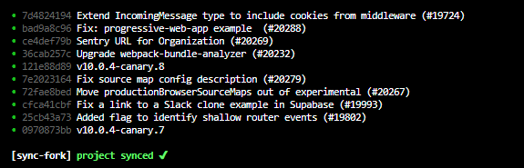
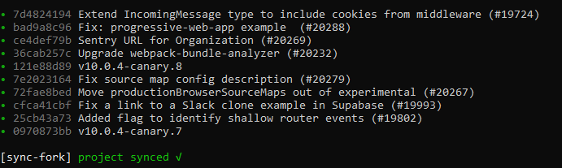

## <span style="color: #ea4a5a;">§</span> the quickest way to sync your fork

```sh
npx sync-fork
```

## Table of Contents:

0. [Requirements](#Requirements)
1. [Usage](#Usage-with-cli)
2. [Parameters](#Parameters)
3. [Usage with package.json](#Usage-with-packagejson)
4. [Why sync-fork ?](#Why-sync-fork-)
5. [What is a fork ?](#What-is-a-fork)
6. [Git best pratices](#Git-best-pratices)

## Requirements

-   [Git](https://git-scm.com/)
-   [Node.js](https://nodejs.org/en/)

## Usage with cli

**Add a remote url**

```sh
npx sync-fork -a <remoteUrl>
```

it's a shorthand for:

```
git remote add upstream <remote git url>
```

> make sure you've added the remote url and have access to the repository ( if already done skip it )

```sh
npx sync-fork
```

<span style="color: #ea4a5a;">§</span> **synced!!** ✔️

## Parameters

### **Upstream name:**

**-u** _--upstream_

```sh
npx sync-fork -u <upstreamName>
```

examples:

```
 sync-fork -u heroku
# heroku
```

### **Branch name:**

**-b** _--branch_

```sh
npx sync-fork -b <branchName>
```

examples:

```sh
 sync-fork -b main
# github new default naming

 sync-fork -b v2
# parcel

 sync-fork -b canary
# next.js
```

some parameters can be used together:

`sync-fork -u upstreamName -b branchName`

### **Sync and log changes:**

**-l** _--log_

```sh
npx sync-fork -l
```

will sync and give what's new (the 10 last commits) in a nice format

> Example from **next.js** _git log_ - hyper cmd - (20 dec 2020)



<details><summary>cmd example</summary>

> Example from **next.js** _git log_ - windows cmd - (20 dec 2020)



</details>

### **Only log changes:**

**--log-only**

if you only want to see this nice formatted log at any time: (will skip sync)

```sh
npx sync-fork --log-only
```

### **Add a remote url:**

**-a** _--add_

add a remote upstream url ( the first step after forking a new project )

```sh
npx sync-fork -a <remoteUrl>
```

examples:

```sh
 sync-fork -a https://github.com/facebook/react.git
# react
# then:
npx sync-fork
```

### **Remove a remote url:**

**-r** _--remove_

remove a mistyped url by remote name

```sh
npx sync-fork -r <remoteName>
```

examples:

```sh
 git remote -v
# list all remote urls, then:
 sync-fork -r wrongName
# removing a mistyped url by remote name
```

### **Debug:**

**-d** _--debug_

(advanced use) use only if sync-fork isn't working

```sh
npx sync-fork -d
```

## Usage with package.json

```sh
yarn add sync-fork --dev
```

```json
//package.json

"scripts": {
  "sync": "sync-fork",
  "start": "...",
  "build": "...",
},

// passing parameters
  "sync": "sync-fork -u upstream -b branch",
```

then just run

```sh
yarn sync
```

> you can include this in your README.md description

<hr>

## Why sync-fork ?

-   Syncing a fork can be tedious, it needs at least 4 different commands, imagine repeting it daily for 10, 100 projects, let's simplify it with just one command, Just **sync-fork**

-   They approved your pr ? Just **sync-fork**

-   Need to stay sharp within a project that updates every hour like react ? Just **sync-fork**

-   Working on a old project ? Just **sync-fork**

### How it works ?

-   Checkout to master/main branch
-   Fetch recent changes
-   Merges changes
-   Push changes to your fork
-   Everything pretty

## What is a fork?

> Forking a repository allows you to freely experiment with changes without affecting the original project. Most commonly, forks are used to either propose changes to someone else's project or to use someone else's project as a starting point for your own idea.

## How to fork?

https://docs.github.com/free-pro-team@latest/github/getting-started-with-github/fork-a-repo

## Git best pratices

**origin**: (example: Usename/react) (reference of your fork )

**upstream**: (example: facebook/react) (reference of the original forked project)

**master** / **main** <- the name of default branch

> ( github recently adopeted "main" for new created repositories )

> some projects use a custom name like: **v2** / **canary** / **berry** / ...

**git clone** you should clone your fork: `git clone <your_fork_url>`

-   make changes in a new branch
-   commit new features/fixes
-   send a pull request to the original project

> some projects may differ, verify their contributing guides

<hr>

#### sync-fork version 0.5.0 - [under dev]

> contributions welcome, more info coming soon: builder, tests
